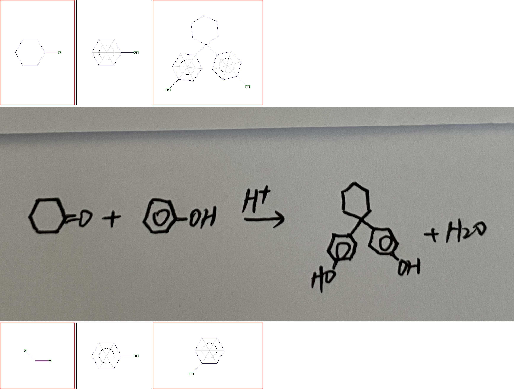

# Graph Matching Tool #

## Environments

Standard python3 environment is ok. Use pip to install any lacking libraries according to error messages procuded on terminal.

## python tool --- eval.py

### usage

python eval.py -h
```
usage: graph matching tool [-h] [-rec REC] [-lab LAB] [-output OUTPUT] [-viz VIZ] [-img_prefix IMG_PREFIX] [-ref_metric REF_METRIC] [-viz_output VIZ_OUTPUT] [-num_workers NUM_WORKERS]

optional arguments:
  -h, --help            show this help message and exit
  -rec REC              output result by your model
  -lab LAB              label file
  -output OUTPUT        output file
  -viz VIZ              if bigger than zero, will do visualization
  -img_prefix IMG_PREFIX
                        img root path
  -ref_metric REF_METRIC
                        when viz is on, will divide result into true or false according to this metric
  -viz_output VIZ_OUTPUT
                        visualization output dir
  -num_workers NUM_WORKERS
                        for multi process
```


### inputs

* __rec__: The inference result of your model. It should be a text file, each line of which represents a sample's result. The format of each line is '<img_name>\t<output_string>'. For example:
```
valid_00001.jpg	 \chemfig { ?[a] =[:90] -[:30] branch( -[:90] H O branch) =[:330] -[:270] =[:210] ?[a,{-}] -[:270] O H }
valid_00002.jpg	 \chemfig { ?[a] =[:60] -[:0] =[:300] branch( -[:210] O ?[a,{-}] branch) -[:315] C O O H } \xrightarrow { \triangle } \chemfig { ?[a] -[:60] -[:0] -[:300] -[:240] O -[:180] ?[a,{-}] } + C O _ { 2 } \uparrow + H _ { 2 } \uparrow
```
* __lab__: The label of test set. It is also a text file which has same format with __rec__. The label string must be __ssml_normed__.

### outputs

* __output produced by terminal__: After graph matching tool has finished running, you will get outputs from terminal as follows. 
    * The 'metric struct.line' is __Exact Match (EM)__, which means all chemical structures and any other latex strings in a sample should be correctly recognized.
    * The 'metric struct' is __Structure Exact Match (Structure EM)__, where only chemical structures should be correctly recognized in a sample.
    * The 'metric base' is just for reference, which is obtained by directly calculating edit distance between rec and lab strings.

```
----- metric base ------
wacc=50.4526 % wcor=55.5939 % d=35946 s=53233 i=10325 n=200826
sent acc = 0.0000 %( 0/2991 )
------ metric struct ------
wacc=100.0000 % wcor=100.0000 % d=0 s=0 i=0 n=2991
sent acc = 33.0993 %( 990/2991 )
------ metric struct.line ------
wacc=100.0000 % wcor=100.0000 % d=0 s=0 i=0 n=2991
sent acc = 15.6804 %( 469/2991 )
```

* __output__: a text file which records each sample's result. It consists of multiple lines where each line corresponds to a sample. The format of each line is as follows. Split each line by '\t' and you will get 5 spans, which represent __image name__, __result of Structure EM__(1 means error, 0 means correct), __result of EM__, __label string__, __rec string__ separately.

```
valid_00007	0	0	\chemfig { -[:45.0,1.0] -[:315.0,1.0] -[:45.0,1.0] -[:315.0,1.0] C O C l } + H _ { 2 } \xrightarrow { P d - B a S O _ { 4 } } \chemfig { -[:45.0,1.0] -[:315.0,1.0] -[:45.0,1.0] -[:315.0,1.0] C H O } + H C l	\chemfig { -[:45] -[:315] -[:45] -[:315] C O C l } + H _ { 2 } \xrightarrow { P d - B a S O _ { 4 } } \chemfig { -[:45] -[:315] -[:45] -[:315] C H O } + H C l


```

### optional 

* __num_workers__: the number of process used
* __viz__: if bigger than zero, will do visualization
* __viz_output__: if viz is on, the outputed images will be saved to this folder. An example of a visulized image is as follows. From top to bottom, you can see three lines which mean label structures, input image and rec structures separately. The red border means the corrosponding chemical structure is wrongly recognized.

* __ref_metric__: when viz is on, will divide outputed images into true(0) or false(1) according to this metric. It can be 'struct' or 'struct.line'
* __img_prefix__: image root path. It will be joined with image name in input text files to find real image path to do visualization.


### demo
see debug.sh for linux and debug.bat for windows.

'test_decode_result.txt' is a demo of submission file.

'data/mini_valid_ssml_normed.txt' is a demo of label file.


# Simple Parsing Tool

* ssml_parser.py
  * line 208: 'root_atom' is the parsing result
  ```python
  root_atom = parse_ssml(" ".join(chemfig_str.split(" ")[2:-1]))
  ```